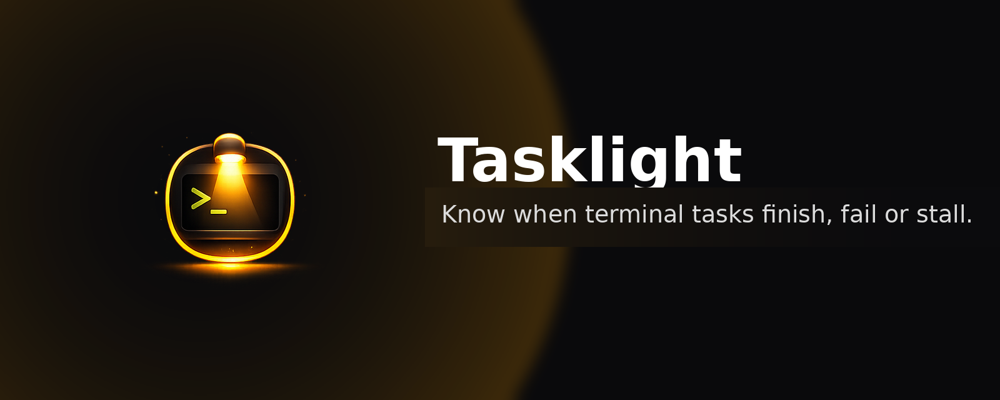

# Tasklight

<p align="center">
  
</p>

Tasklight is a small CLI for running long developer tasks and getting notified when they finish.

It is meant for commands you start and then forget to check:

- test suites
- builds
- coding-agent sessions
- deployment scripts
- Docker jobs
- ffmpeg jobs
- Django/Rails/etc. commands
- anything else that may run for a while in your terminal

Tasklight is currently both:

```bash
tasklight run -- <command> [args...]
tasklight notify --subtitle "✅ Done" --message "Short summary"
```

`tasklight run` runs a command normally, streams output live, forwards stdin, preserves the command's exit code, and sends a desktop notification when the command exits.

`tasklight notify` lets integrations and scripts send Tasklight notifications directly.

## Why

Developers often kick off a long-running task, switch to another window, and later realize the task finished, failed, or needed attention minutes ago.

This is especially common with coding agents and test/build loops. Tasklight keeps the workflow terminal-first while giving you a small notification when it is time to come back.

Tasklight is intentionally boring at the start: no daemon, no account, no cloud service, no telemetry, no terminal scraping, and no AI-specific behavior.

## Current status

Implemented:

- `tasklight run -- <command>`
- live stdout/stderr streaming
- stdin forwarding
- child exit-code preservation
- `--name` for readable notification names
- `--cwd` for running from another directory
- `tasklight notify` for direct script/integration notifications
- separate `pi-tasklight` Pi extension package support via `tasklight notify`
- macOS notifications via `osascript`
- Linux notifications via `notify-send`
- optional macOS click-to-focus via `terminal-notifier`
- best-effort tmux pane selection when click actions are available

Planned:

- idle/stuck detection, for example `--idle 5m`
- output match detection, for example `--match "approve"`
- deeper terminal/window focus support
- config files
- packaging/release builds

## Quick start

Build locally:

```bash
go build -o bin/tasklight ./cmd/tasklight
```

Run a command:

```bash
./bin/tasklight run -- pnpm test
```

Run a named task:

```bash
./bin/tasklight run --name "Frontend tests" -- pnpm test
```

Run from another directory:

```bash
./bin/tasklight run --cwd frontend -- pnpm build
```

Send a direct notification:

```bash
./bin/tasklight notify --subtitle "✅ Pi is ready" --message "Fixed failing auth test setup."
```

Check exit-code preservation:

```bash
./bin/tasklight run -- sh -c 'exit 42'
echo $?
# 42
```

The `--` separator is required. Everything after `--` is treated as the command to run.

## Examples

```bash
# JavaScript/TypeScript tests
./bin/tasklight run --name "JS tests" -- pnpm test

# Python tests
./bin/tasklight run --name "Pytest" -- pytest

# Django tests
./bin/tasklight run --cwd backend --name "Django tests" -- python manage.py test

# Docker command
./bin/tasklight run --name "Docker build" -- docker build .

# Coding-agent task
./bin/tasklight run --name "Pi task" -- pi "fix this failing test"

# Direct notification from a script or integration
./bin/tasklight notify --title "Pi" --subtitle "✅ Task finished" --message "Updated tests and mocks."
```

## Pi integration

The Pi integration lives in a separate package/repository: `pi-tasklight`.

It adds a Pi slash command:

```text
/tl fix the failing auth test
```

When the Pi task finishes, the extension sends a Tasklight notification with a short summary. It does not make a second summarization model call; instead, it adds a small per-turn instruction asking Pi to include a short notification summary marker, then strips that marker from the saved/displayed assistant message.

Local development with sibling repositories:

```bash
# in ~/Work/tasklight
go build -o bin/tasklight ./cmd/tasklight

# in ~/Work/pi-tasklight
export TASKLIGHT_BIN="$HOME/Work/tasklight/bin/tasklight"
pi -e ./extensions/tasklight.ts
```

Inside Pi:

```text
/tl run the tests and fix any failures
/tl-on       # enable notifications for every normal Pi prompt in this session
/tl-off      # disable always-on mode
/tl-toggle   # toggle always-on mode
/tl-doctor   # run tasklight doctor inside Pi
/tl-test
```

Install the local Pi package:

```bash
pi install ~/Work/pi-tasklight
```

See the `pi-tasklight` repository README for details.

## Doctor

Check local notification/focus provider setup:

```bash
./bin/tasklight doctor
```

Inside Pi with `pi-tasklight` loaded:

```text
/tl-doctor
```

`doctor` checks platform notification providers, optional `terminal-notifier`, Tasklight sender/icon setup, and tmux availability.

## Notifications

### macOS

Tasklight works on macOS using the built-in `osascript` command.

Tasklight bundles the app icon from `assets/brand/tasklight-app-icon-1024.png` and uses it for notifications when the notification provider supports custom icons. Override it with `--icon /path/to/icon.png` or `TASKLIGHT_ICON=/path/to/icon.png`.

The built-in `osascript` fallback does not support custom icons, so Tasklight does not pass an icon there and does not show an image placeholder.

For proper macOS notification identity, custom icons, and better click behavior today, install `terminal-notifier`:

```bash
brew install terminal-notifier
```

Tasklight does not auto-install `terminal-notifier`. It is an optional external provider: without it, Tasklight falls back to `osascript`.

When `terminal-notifier` is available, Tasklight creates and registers a tiny local `Tasklight.app` helper under `~/Library/Application Support/Tasklight/`. Tasklight passes that bundle ID as the notification sender, so the left-side notification icon is Tasklight rather than `terminal-notifier`.

Then you can ask Tasklight to focus an app when the notification is clicked:

```bash
./bin/tasklight run --activate-app Terminal -- pnpm test
./bin/tasklight run --activate-app iTerm2 -- pnpm test
./bin/tasklight run --activate-app "Visual Studio Code" -- pnpm test
./bin/tasklight run --activate-app Cursor -- pnpm test
```

Click-to-focus is best effort. macOS notification click handling is limited without a native helper app, so this behavior may vary by terminal and macOS settings.

When running inside tmux, Tasklight also records the current pane and attempts to select it when the notification is clicked.

### Linux

Tasklight uses `notify-send` on Linux.

Install it with your package manager:

```bash
# Ubuntu/Debian
sudo apt install libnotify-bin

# Fedora
sudo dnf install libnotify

# Arch
sudo pacman -S libnotify
```

Linux currently supports basic finish/failure notifications. Tasklight passes the bundled app icon to `notify-send`. Deep click-to-focus support is planned for later because it depends on the desktop environment, X11 vs Wayland, and terminal app support.

## CLI reference

```bash
tasklight run [options] -- <command> [args...]
tasklight notify [options]
tasklight doctor
```

`run` options:

```text
--name string           Human-readable task name, used by notifications
--cwd string            Working directory for the command
--activate-app string   App name or bundle ID to activate when clicking the notification
-h, --help              Show help
```

`notify` options:

```text
--title string          Notification title (default "Tasklight")
--subtitle string       Notification subtitle
--message string        Notification body/message
--activate-app string   App name or bundle ID to activate when clicking the notification
--icon string           Path to a notification icon image
--sound                 Play the platform's default notification sound when supported
-h, --help              Show help
```

## Design principles

- Be a transparent wrapper around the command.
- Preserve the child process exit code.
- Stream output live.
- Do not send command output anywhere.
- Do not store command output by default.
- Avoid shell execution unless the user explicitly runs a shell themselves.
- Prefer small, dependable platform integrations over a complex daemon.

## Development

Requirements:

- Go 1.19 or newer
- macOS or Linux

Common commands:

```bash
# Run tests
go test ./...

# Run vet
go vet ./...

# Build local binary
go build -o bin/tasklight ./cmd/tasklight

# Show help
go run ./cmd/tasklight --help
```

Cross-compile check for Linux:

```bash
GOOS=linux GOARCH=arm64 go build ./...
```

## Roadmap

Near-term:

- `--idle 5m` to notify when a task stops producing output
- `--match "text"` to notify when output needs attention
- improved notification provider selection
- `tasklight doctor`

Later:

- config file support
- richer tmux integration
- better Linux focus support
- native macOS notification helper so Tasklight no longer depends on `terminal-notifier` for icons/click actions
- Homebrew formula and release binaries
