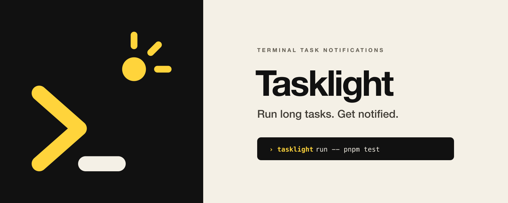

# Tasklight

<p align="center">
  
</p>

<p align="center">
  <a href="https://www.npmjs.com/package/@tasklight/cli"></a>
  <a href="https://www.npmjs.com/package/@tasklight/cli"></a>
  <a href="https://github.com/revazi/tasklight/actions/workflows/ci.yml"></a>
  <a href="https://github.com/revazi/tasklight/actions/workflows/codeql.yml"></a>
  <a href="./LICENSE"></a>
</p>

Tasklight is a small CLI for running long developer tasks and getting notified when they finish.

It is meant for commands you start and then forget to check:

- test suites
- builds
- coding-agent sessions
- deployment scripts
- Docker jobs
- ffmpeg jobs
- Django/Rails/etc. commands
- anything else that may run for a while in your terminal

Tasklight is currently both:

```bash
tasklight run -- <command> [args...]
tasklight notify --subtitle "✅ Done" --message "Short summary"
```

`tasklight run` runs a command normally, streams output live, forwards stdin, preserves the command's exit code, and sends a desktop notification when the command exits.

`tasklight notify` lets integrations and scripts send Tasklight notifications directly.

## Why

Developers often kick off a long-running task, switch to another window, and later realize the task finished, failed, or needed attention minutes ago.

This is especially common with coding agents and test/build loops. Tasklight keeps the workflow terminal-first while giving you a small notification when it is time to come back.

Tasklight is intentionally boring at the start: no daemon, no account, no cloud service, no telemetry, no terminal scraping, and no AI-specific behavior.

## Current status

Implemented:

- `tasklight run -- <command>`
- live stdout/stderr streaming
- stdin forwarding
- child exit-code preservation
- `--name` for readable notification names
- `--cwd` for running from another directory
- `--idle 5m` notifications when a running task stops producing output
- `--match 'approve|waiting|failed'` notifications when output needs attention
- `tasklight notify` for direct script/integration notifications
- clean integration boundary: Tasklight stays a generic CLI; integrations call it from separate packages
- macOS notifications via bundled native `Tasklight.app`, with `terminal-notifier`/`osascript` fallbacks
- Linux notifications via `notify-send`, with desktop/session capability diagnostics
- iTerm2 + tmux click-to-return
- best-effort app activation elsewhere
- detailed click-to-focus diagnostics with `tasklight doctor --focus`
- approval-gated npm provenance and GitHub release automation
- optional global and project-local configuration defaults

Planned:

- deeper terminal/window focus support

## Installation

Install with npm:

```bash
npm install -g @tasklight/cli
```

Or run without installing globally:

```bash
npx -y @tasklight/cli doctor
```

Install with Go:

```bash
go install github.com/revazi/tasklight/cmd/tasklight@latest
```

Or build from source:

```bash
git clone https://github.com/revazi/tasklight.git
cd tasklight
go build -o bin/tasklight ./cmd/tasklight
```

The npm package bundles the native macOS notification helper. Source builds can create it with:

```bash
make macos-helper
```

`terminal-notifier` is optional fallback-only support:

```bash
brew install terminal-notifier
```

Linux desktop notifications require `notify-send`:

```bash
# Ubuntu/Debian
sudo apt install libnotify-bin

# Fedora
sudo dnf install libnotify

# Arch
sudo pacman -S libnotify
```

Check your setup:

```bash
tasklight --version
tasklight doctor
```

## Quick start

Run a command:

```bash
tasklight run -- pnpm test
```

Run a named task:

```bash
tasklight run --name "Frontend tests" -- pnpm test
```

Run from another directory:

```bash
tasklight run --cwd frontend -- pnpm build
```

Notify when a command is still running but has produced no output for five minutes:

```bash
tasklight run --idle 5m -- your-agent "continue implementation"
```

Tasklight sends one idle notification per quiet period. Output on stdout or stderr resets the timer and allows a later idle notification; the command keeps running throughout.

Notify when stdout or stderr output matches a Go regular expression:

```bash
tasklight run --match 'approve|waiting|failed' -- your-agent "implement feature"
```

The regexp is validated before the command starts. Matching is evaluated as output arrives, including interactive prompts without a trailing newline. Tasklight includes a short, control-character-stripped excerpt around the match and sends only the first match notification for each command invocation.

Send a direct notification:

```bash
tasklight notify --subtitle "✅ Build finished" --message "Frontend assets are ready."
```

Check exit-code preservation:

```bash
tasklight run -- sh -c 'exit 42'
echo $?
# 42
```

The `--` separator is required. Everything after `--` is treated as the command to run.

## Examples

```bash
# JavaScript/TypeScript tests
tasklight run --name "JS tests" -- pnpm test

# Python tests
tasklight run --name "Pytest" -- pytest

# Django tests
tasklight run --cwd backend --name "Django tests" -- python manage.py test

# Docker command
tasklight run --name "Docker build" -- docker build .

# Coding-agent task, with stuck-output and attention detection
tasklight run --name "Agent task" --idle 5m --match 'approve|waiting|failed' -- your-agent "fix this failing test"

# Direct notification from a script or integration
tasklight notify --title "Deploy" --subtitle "✅ Task finished" --message "Updated production assets."
```

## Configuration

Tasklight optionally loads TOML configuration from these locations, in order:

1. `$XDG_CONFIG_HOME/tasklight/config.toml`, or `~/.config/tasklight/config.toml` when `XDG_CONFIG_HOME` is unset
2. `.tasklight.toml` in the current project directory
3. Explicit CLI flags

Later sources override only the settings they define. No configuration file is required.

```toml
[run]
activate_app = "iTerm2"
sound = false
idle = "5m"
match = "approve|waiting|failed"

[notify]
activate_app = "iTerm2"
sound = true
```

`run.idle` uses Go duration syntax. `run.match` is a Go regular expression. Set either value to an empty string in `.tasklight.toml` to disable an inherited global default. Invalid TOML, unknown keys, invalid durations, and invalid regexps produce a path-specific error before the command or notification runs.

CLI flags override configuration, including explicit boolean values such as `--sound=false`.

## Integrations

Tasklight is intentionally a generic notification CLI. It owns command running, desktop notification providers, package distribution, and terminal/tmux focus behavior.

Integration-specific code belongs in separate packages that call `tasklight notify` or depend on `@tasklight/cli`.

Known integrations:

- [`@tasklight/pi-tasklight`](https://github.com/revazi/pi-tasklight) — Pi coding-agent extension for Tasklight notifications

Report issues in the repository that owns the failing behavior:

- Tasklight CLI, notifications, packaging, or focus bugs: <https://github.com/revazi/tasklight/issues>
- Pi slash commands or Pi extension behavior: <https://github.com/revazi/pi-tasklight/issues>

## Doctor

Check local notification/focus provider setup:

```bash
tasklight doctor
```

`doctor` checks platform notification providers, the native macOS helper or fallbacks, Tasklight icon setup, and tmux availability. On macOS it also reports helper signing, hardened-runtime, quarantine, LaunchServices registration, and notification-authorization status.

### Troubleshooting click-to-focus

Generate one pasteable report when a notification does not return to the expected terminal or tmux pane:

```bash
tasklight doctor --focus
```

The focus report includes the detected terminal app and bundle ID, iTerm/Terminal session metadata, terminal and tmux client TTYs, tmux socket/session/window/pane data, selected notification provider, generated click command or script path, and debug log paths.

Debug logs are opt-in. Set `TASKLIGHT_FOCUS_DEBUG=1` (also accepts `true`, `yes`, or `on`) on the command that sends the notification, reproduce the click, then run the report again to locate the logs:

```bash
TASKLIGHT_FOCUS_DEBUG=1 tasklight notify --message "Focus test"
TASKLIGHT_FOCUS_DEBUG=1 tasklight doctor --focus
```

Review terminal and tmux names and the focus execution log before posting them publicly. Values such as `0`, `false`, `no`, and `off` do not enable logging.

## Notifications

### macOS

Tasklight works on macOS using the built-in `osascript` command.

Tasklight bundles the app icon from `assets/brand/tasklight-app-icon-1024.png` and uses it for notifications when the notification provider supports custom icons. Override it with `--icon /path/to/icon.png` or `TASKLIGHT_ICON=/path/to/icon.png`.

The built-in `osascript` fallback does not support custom icons, so Tasklight does not pass an icon there and does not show an image placeholder.

For proper macOS notification identity, custom icons, and reliable click behavior, the npm package bundles a tiny native `Tasklight.app` notification helper. For the planned v0.2.0 npm release, the helper is ad hoc signed with the hardened runtime and verified during packaging; it is not claimed as an Apple-notarized standalone application. Source builds can create it with:

```bash
make macos-helper
```

If the native helper is unavailable, Tasklight can use `terminal-notifier` as an optional fallback:

```bash
brew install terminal-notifier
```

Tasklight does not auto-install `terminal-notifier`. Without the native helper or `terminal-notifier`, Tasklight falls back to `osascript`.

Then you can ask Tasklight to focus an app when the notification is clicked:

```bash
tasklight run --activate-app Terminal -- pnpm test
tasklight run --activate-app iTerm2 -- pnpm test
tasklight run --activate-app "Visual Studio Code" -- pnpm test
tasklight run --activate-app Cursor -- pnpm test
```

Click-to-focus is currently optimized for iTerm2 + tmux. Other terminals/editors use best-effort app activation until deeper support is added.

When running inside tmux, Tasklight also records the current pane and attempts to select it when the notification is clicked.

If Tasklight does not appear under macOS notifications, permission is denied, a helper process remains unexpectedly, or a direct-download distribution is being considered, see the [native macOS helper packaging and troubleshooting guide](docs/MACOS_HELPER.md).

### Linux

Tasklight uses `notify-send` on Linux.

Install it with your package manager:

```bash
# Ubuntu/Debian
sudo apt install libnotify-bin

# Fedora
sudo dnf install libnotify

# Arch
sudo pacman -S libnotify
```

Linux currently supports informational completion, failure, idle, and output-match notifications. Tasklight passes the bundled app icon to `notify-send`.

Linux notification actions are disabled by default. When running inside tmux, users can explicitly enable a best-effort **Select tmux target** action if their `notify-send` and notification daemon support actions:

```bash
TASKLIGHT_LINUX_ACTIONS=1 tasklight run -- pnpm test
```

The action runs only the captured tmux client/window/pane command; it does not promise to raise or focus the terminal window. Tasklight does not silently install or invoke window-control tools. Action delivery still varies across notification daemons and GNOME/KDE versions, so this remains opt-in and best-effort. Outside tmux, Linux notifications stay informational.

Run diagnostics to report the active desktop/session type, Wayland/X11 displays, D-Bus notification service, `notify-send` action capability, optional tools (`gdbus`, `wmctrl`, `xdotool`, and `busctl`), and tmux target:

```bash
tasklight doctor
tasklight doctor --focus
```

`wmctrl` and `xdotool` are X11-oriented and are reported only as optional capabilities; Tasklight does not invoke them. Wayland compositors commonly prevent arbitrary applications from stealing focus. Linux focus remains explicit and best-effort rather than changing focus automatically without user action.

## CLI reference

```bash
tasklight --version
tasklight run [options] -- <command> [args...]
tasklight notify [options]
tasklight doctor [--focus]
```

`run` options:

```text
--name string           Human-readable task name, used by notifications
--cwd string            Working directory for the command
--activate-app string   App name or bundle ID to activate when clicking the notification
--idle duration         Notify after this duration without stdout/stderr output
--match regexp          Notify when an output line matches this Go regexp
--sound                 Play the default notification sound
-h, --help              Show help
```

`notify` options:

```text
--title string          Notification title (default "Tasklight")
--subtitle string       Notification subtitle
--message string        Notification body/message
--activate-app string   App name or bundle ID to activate when clicking the notification
--icon string           Path to a notification icon image
--sound                 Play the platform's default notification sound when supported
-h, --help              Show help
```

`doctor` options:

```text
--focus                  Show detailed notification click-to-focus diagnostics
-h, --help               Show help
```

## Design principles

- Be a transparent wrapper around the command.
- Preserve the child process exit code.
- Stream output live.
- Do not send command output anywhere.
- Do not store command output by default.
- Avoid shell execution unless the user explicitly runs a shell themselves.
- Prefer small, dependable platform integrations over a complex daemon.

## Development

Requirements:

- Go 1.19 or newer
- macOS or Linux on arm64 or amd64 for supported release builds

Common commands:

```bash
# Full local verification
make check

# Bounded parser and command-construction fuzzing
make fuzz-smoke

# Cross-compile supported Go targets
make cross-compile

# Build local binary
make build

# Show help
make run
```

Build and smoke-test the local npm CLI package:

```bash
make npm-package
make package-smoke
```

Project policies and practices are documented in [CONTRIBUTING.md](CONTRIBUTING.md), [SECURITY.md](SECURITY.md), and the [OpenSSF Best Practices self-assessment](docs/OPENSSF_BEST_PRACTICES.md).

## Roadmap

Near-term:

- improved notification provider selection

Later:

- richer tmux integration
- better Linux focus support
- continue improving the native macOS notification helper and iTerm2/tmux focus path
- Homebrew formula and release binaries
